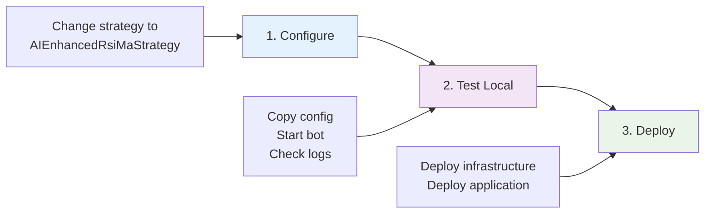
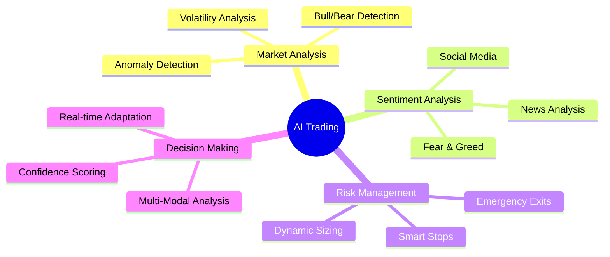
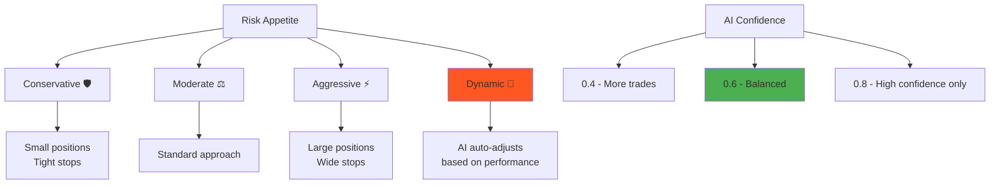
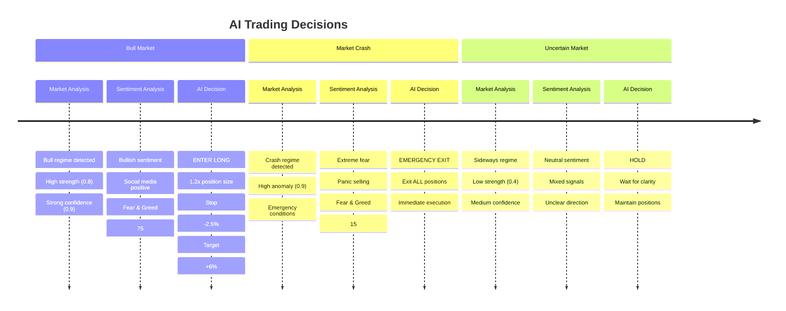
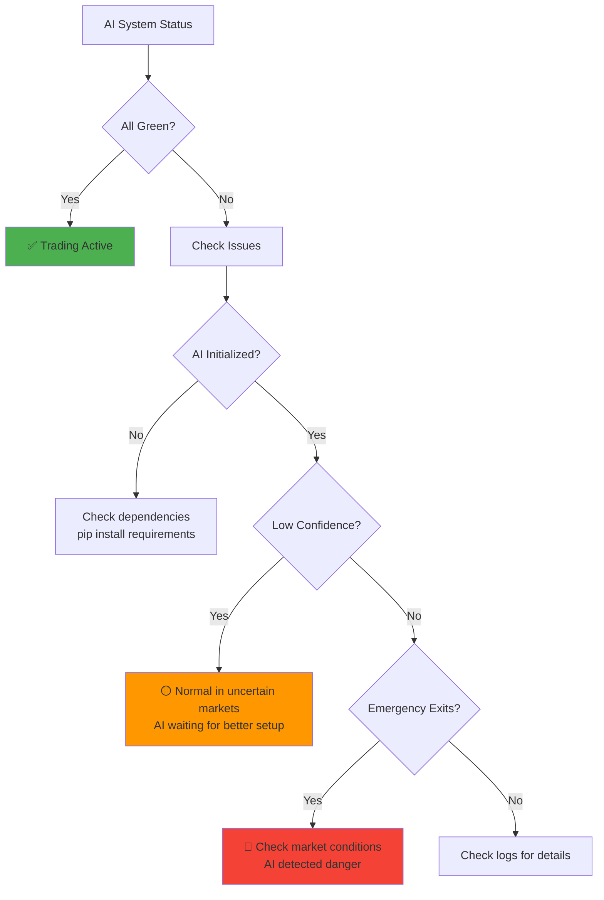
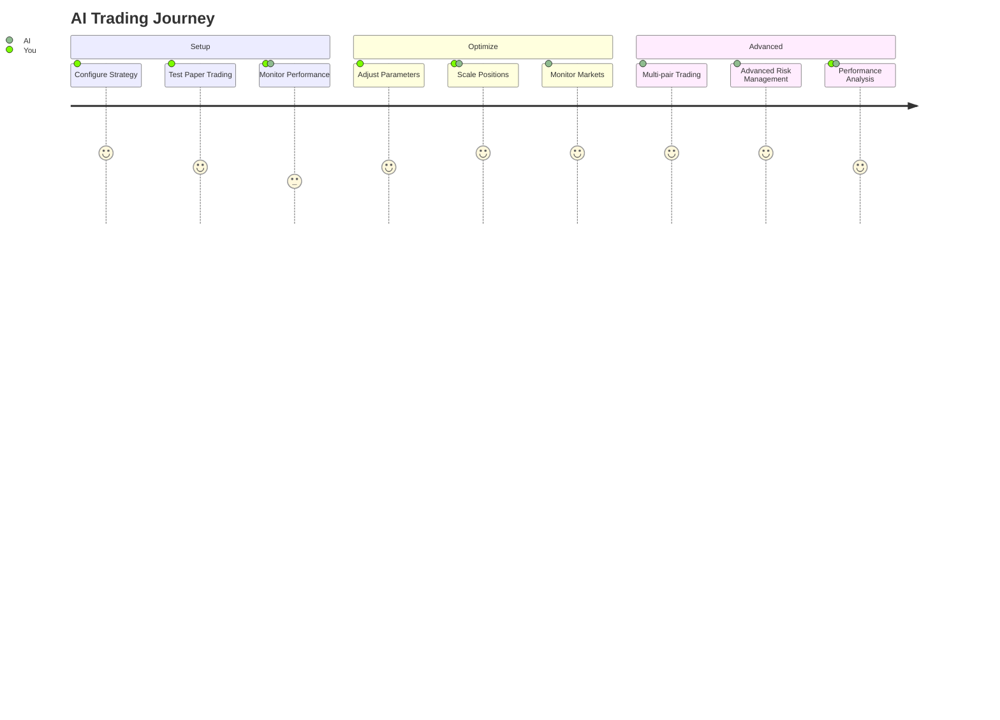

# AI-Enhanced FreqTrade Quick Start

## 🚀 5-Minute Setup



### Step 1: Configure Strategy
```json
{
    "strategy": "AIEnhancedRsiMaStrategy",
    "strategy_config": {
        "ai_confidence_threshold": 0.6,
        "risk_appetite": "dynamic",
        "enable_sentiment_analysis": true,
        "enable_market_regime_adaptation": true,
        "emergency_exit_enabled": true
    }
}
```

### Step 2: Test Locally
```bash
cp config.ai-enhanced.json config.dryrun.json
make up
make logs  # Watch AI decisions in real-time
```

### Step 3: Deploy to Production
```bash
make terraform-deploy    # Infrastructure
make deploy-terraform    # Application
```

## 🤖 AI Features Overview



### AI Configuration Options



## 📊 AI Decision Examples



## 🔍 Monitoring & Troubleshooting



### Quick Status Check
```bash
# View AI decisions in logs
make logs | grep "AI Decision"

# Check AI system status
docker-compose exec freqtrade freqtrade show-config
```

### Common Scenarios

| Situation | AI Response | Action |
|-----------|-------------|---------|
| 🐂 **Bull Market** | Increase position sizes, higher targets | Normal operation |
| 🐻 **Bear Market** | Reduce positions, tighter stops | Monitor closely |
| 💥 **Market Crash** | Emergency exit all positions | Check news, wait for stability |
| 😐 **Uncertain Market** | Hold/wait for better signals | Patience - AI waiting for clarity |

## 🎛️ Advanced Configuration

### Custom AI Settings
```json
{
    "ai_engine": {
        "risk_management": {
            "risk_appetite": "dynamic",
            "max_portfolio_risk": 0.03,
            "volatility_adjustment": true
        },
        "sentiment_analysis": {
            "confidence_threshold": 0.7,
            "cache_duration_minutes": 10
        },
        "decision_engine": {
            "ai_confidence_threshold": 0.65,
            "enable_dynamic_parameters": true
        }
    }
}
```

### Paper Trading First
```bash
# Always test with paper trading first
"dry_run": true,
"dry_run_wallet": 10000,
"strategy": "AIEnhancedRsiMaStrategy"
```

## 🎯 Next Steps



1. **Start Small** → Paper trade to understand AI behavior
2. **Monitor Closely** → Watch AI decisions and market conditions  
3. **Scale Gradually** → Increase position sizes as confidence grows
4. **Stay Informed** → Keep up with market conditions and AI performance

---

**🤖 Ready to trade with AI? Start with paper trading and let the AI show you its capabilities!** 📈