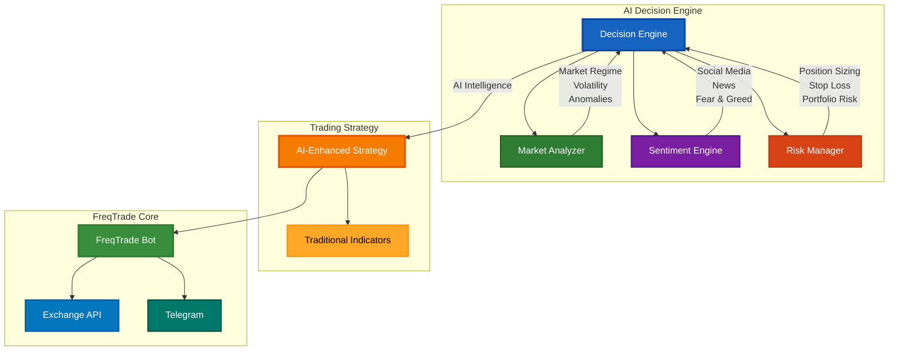
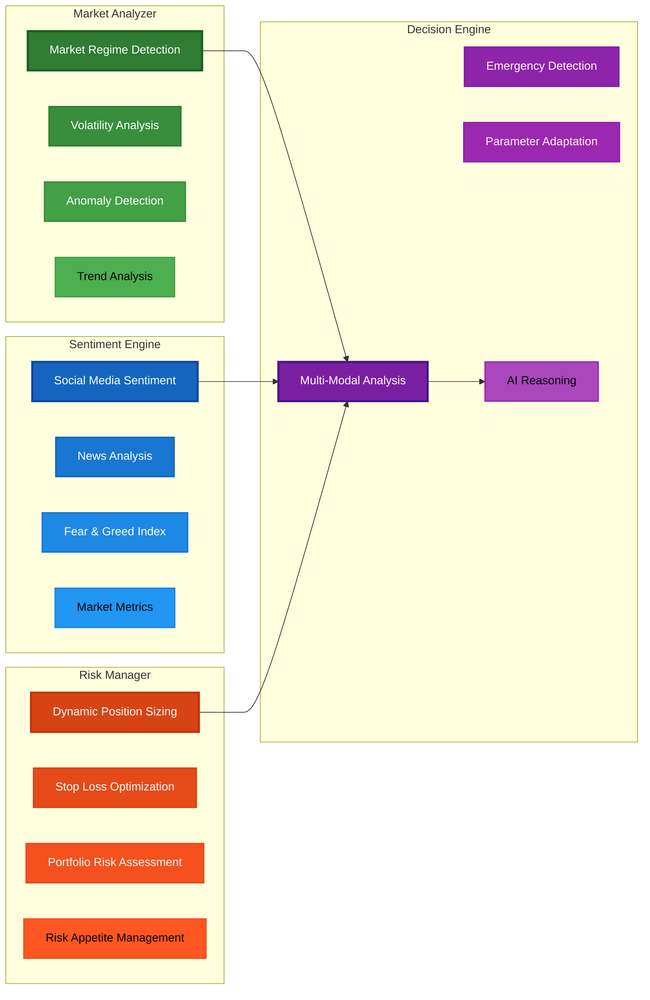
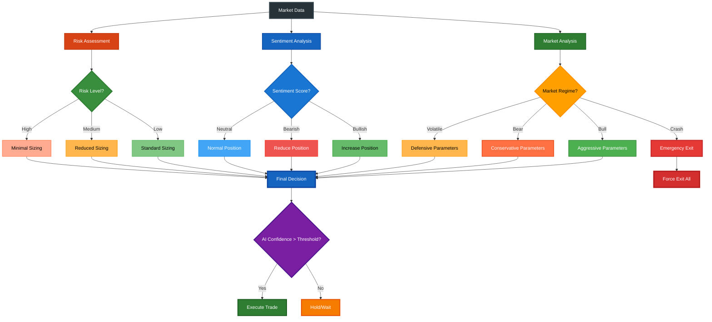
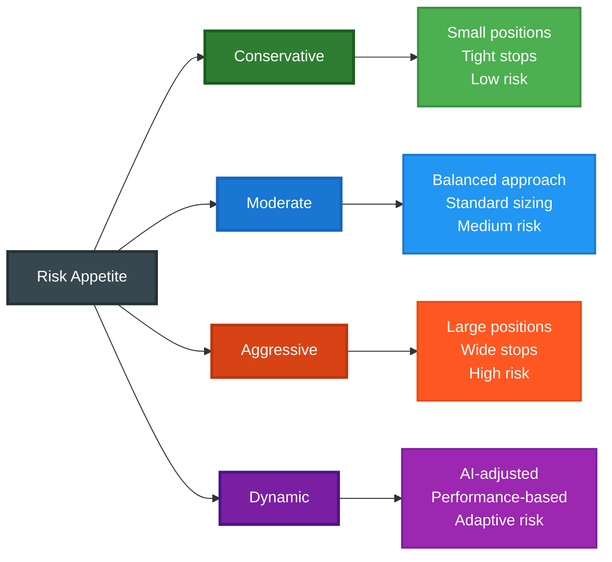

# AI-Enhanced FreqTrade Trading System

## Overview

Advanced AI reasoning integrated into FreqTrade for:
- 🎯 **Risk appetite-based strategy adaptation**
- 🧠 **Real-time market condition analysis**
- ⚡ **Dynamic strategy optimization**
- 📈 **Enhanced profit maximization and loss minimization**

## AI System Architecture



## Core AI Components



### Key Features by Component

| Component | Primary Functions | Output |
|-----------|------------------|---------|
| **Market Analyzer** | Regime detection, volatility analysis, anomaly detection | Market conditions, confidence scores |
| **Sentiment Engine** | Social media, news, fear/greed analysis | Sentiment scores, market psychology |
| **Risk Manager** | Position sizing, stop-loss optimization, portfolio risk | Risk parameters, position recommendations |
| **Decision Engine** | Orchestrates all components, generates final decisions | Trading decisions with AI reasoning |

## AI Decision Flow



## Configuration

### Quick Setup
```json
{
    "strategy": "AIEnhancedRsiMaStrategy",
    "strategy_config": {
        "ai_confidence_threshold": 0.6,
        "risk_appetite": "dynamic",
        "enable_sentiment_analysis": true,
        "enable_market_regime_adaptation": true,
        "emergency_exit_enabled": true
    }
}
```

### Risk Appetite Options



## Usage

### Basic Usage
```python
# Drop-in replacement in FreqTrade config
"strategy": "AIEnhancedRsiMaStrategy"
```

### Advanced Configuration
```python
"strategy_config": {
    "ai_confidence_threshold": 0.7,        // Higher = fewer but higher confidence trades
    "risk_appetite": "dynamic",            // AI adjusts risk automatically
    "enable_sentiment_analysis": true,     // Include market sentiment
    "enable_market_regime_adaptation": true, // Adapt to market conditions
    "emergency_exit_enabled": true         // Allow AI emergency exits
}
```

## AI Decision Examples

```mermaid
graph TD
    subgraph "Bull Market Entry"
        A1[Market: Bull 🐂<br/>Strength: 0.8<br/>Confidence: 0.9]
        B1[Sentiment: Bullish 📈<br/>Social: 0.7<br/>News: 0.6<br/>F&G: 75]
        C1[Technical: ✅<br/>RSI oversold<br/>Above SMA<br/>MACD positive]
        
        A1 --> D1[AI Decision: ENTER LONG]
        B1 --> D1
        C1 --> D1
        D1 --> E1[Position: 1.2x normal<br/>Stop: -2.5%<br/>Target: +6%]
    end
    
    subgraph "Emergency Exit"
        A2[Market: Crash 💥<br/>Anomaly: 0.9<br/>Confidence: 0.95]
        B2[Sentiment: Fear 😨<br/>F&G: 15<br/>High confidence]
        C2[Technical: ❌<br/>Multiple bearish<br/>signals]
        
        A2 --> D2[AI Decision: EMERGENCY EXIT]
        B2 --> D2
        C2 --> D2
        D2 --> E2[Action: Exit ALL<br/>immediately]
    end
    
    subgraph "Hold Decision"
        A3[Market: Sideways ➡️<br/>Strength: 0.4<br/>Confidence: 0.6]
        B3[Sentiment: Neutral 😐<br/>Mixed signals<br/>Low confidence]
        C3[Technical: 🤷<br/>Mixed signals<br/>No clear trend]
        
        A3 --> D3[AI Decision: HOLD]
        B3 --> D3
        C3 --> D3
        D3 --> E3[Wait for better<br/>setup & higher<br/>confidence]
    end
    
    style A1 fill:#2E7D32,stroke:#1B5E20,stroke-width:3px,color:#FFFFFF
    style B1 fill:#1976D2,stroke:#1565C0,stroke-width:2px,color:#FFFFFF
    style C1 fill:#388E3C,stroke:#2E7D32,stroke-width:2px,color:#FFFFFF
    style D1 fill:#4CAF50,stroke:#388E3C,stroke-width:4px,color:#FFFFFF
    style E1 fill:#66BB6A,stroke:#4CAF50,stroke-width:2px,color:#000000
    
    style A2 fill:#B71C1C,stroke:#D32F2F,stroke-width:3px,color:#FFFFFF
    style B2 fill:#E64A19,stroke:#BF360C,stroke-width:2px,color:#FFFFFF
    style C2 fill:#D32F2F,stroke:#B71C1C,stroke-width:2px,color:#FFFFFF
    style D2 fill:#F44336,stroke:#D32F2F,stroke-width:4px,color:#FFFFFF
    style E2 fill:#EF5350,stroke:#F44336,stroke-width:2px,color:#FFFFFF
    
    style A3 fill:#455A64,stroke:#37474F,stroke-width:3px,color:#FFFFFF
    style B3 fill:#607D8B,stroke:#455A64,stroke-width:2px,color:#FFFFFF
    style C3 fill:#546E7A,stroke:#455A64,stroke-width:2px,color:#FFFFFF
    style D3 fill:#FF9800,stroke:#F57C00,stroke-width:4px,color:#000000
    style E3 fill:#FFB74D,stroke:#FFA726,stroke-width:2px,color:#000000
```



## Testing

```bash
# Test core AI algorithms
python test_ai_core.py

# Test full integration (requires FreqTrade)
python test_ai_integration.py
```

## Key Benefits

| Benefit | Description | Impact |
|---------|-------------|---------|
| 📈 **Enhanced Profits** | AI identifies optimal entry/exit points | Better timing, higher win rate |
| 🛡️ **Risk Minimization** | Emergency exits, volatility-adjusted sizing | Capital protection during crashes |
| 🧠 **Adaptive Intelligence** | Parameters adapt to market conditions | Stays effective in changing markets |
| 🔍 **Transparency** | Human-readable AI reasoning | Understand every decision |

## Dependencies

```bash
# Core AI Dependencies
pip install pandas>=1.5.0 numpy>=1.21.0 scikit-learn>=1.3.0
pip install textblob>=0.17.1 requests>=2.31.0

# FreqTrade Dependencies  
pip install freqtrade[all]==2024.1 ta-lib>=0.4.24
```

## Quick Troubleshooting

| Issue | Solution |
|-------|----------|
| AI initialization fails | Check dependencies installed |
| Low AI confidence | Normal in uncertain markets |
| Frequent parameter changes | AI adapting to conditions |
| Emergency exits | Check market news/conditions |

---

**⚠️ Disclaimer**: AI enhances decisions but doesn't guarantee profits. Always test in paper trading first. Never risk more than you can afford to lose.