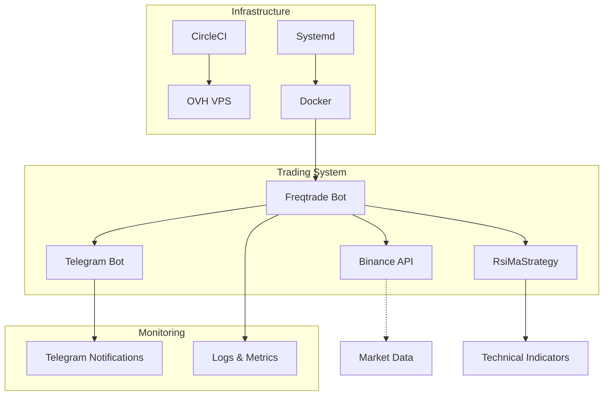
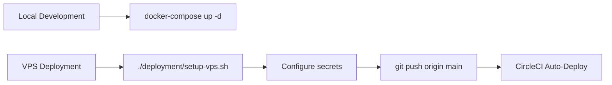
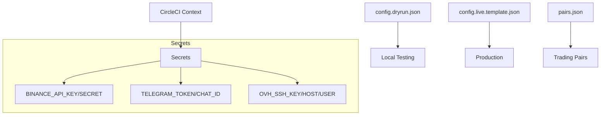
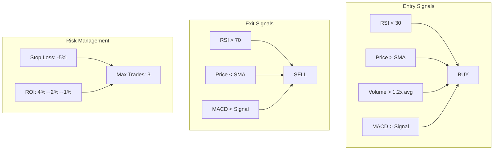
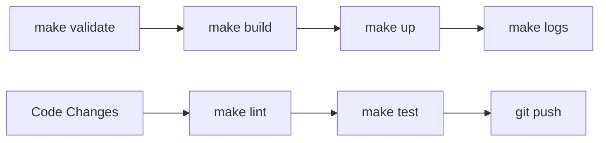
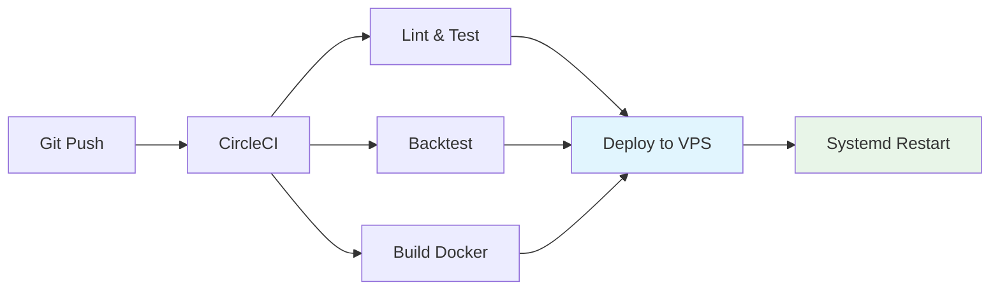
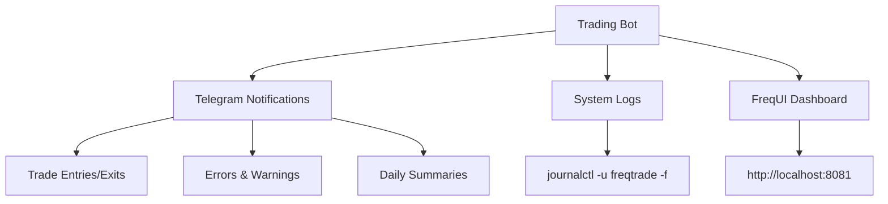
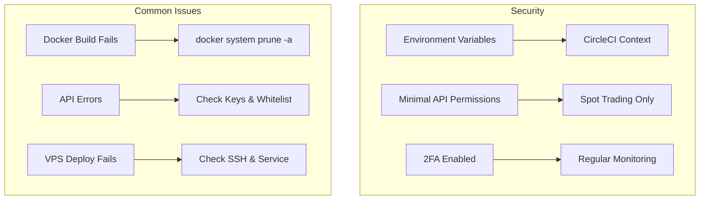

# Freqtrade Trading Bot

Automated cryptocurrency trading bot for Binance with complete CI/CD and VPS deployment.

## Architecture

## Features

- **Exchange**: Binance Spot | **Notifications**: Telegram | **Strategy**: RSI+MA+MACD+Volume
- **Local**: Docker Compose | **Production**: systemd service | **CI/CD**: CircleCI pipeline

## Quick Start

**📋 [Complete Setup Guide](./SETUP.md)** | **✅ [Deployment Checklist](./DEPLOYMENT_CHECKLIST.md)**

**Local**: `make quick-start` or `docker-compose up -d`  
**VPS**: Run `deployment/setup-vps.sh` → Configure secrets → Push to main branch

## Configuration

**Files**: `config.dryrun.json` (testing) | `config.live.template.json` (production) | `pairs.json` (pairs)  
**Secrets**: Set in CircleCI Context `freqtrade-secrets`

## Strategy: RsiMaStrategy

**Indicators**: RSI + SMA + Volume + MACD + Bollinger Bands  
**Risk**: -5% stop loss, ROI table, max 3 trades

## Development

**Commands**: `make quick-start` | `make validate` | `make logs` | `make down`

## CI/CD Pipeline

## Monitoring

**Local**: `make logs` | **VPS**: `journalctl -u freqtrade -f` | **UI**: http://localhost:8081

## Security & Troubleshooting

**Security**: Environment variables only | Minimal API permissions | 2FA enabled  
**Cost**: OVH VPS SSD 1 (~€3-€5/month) | 1 vCPU, 2GB RAM, 20GB SSD

## ⚠️ Disclaimer

**Trading cryptocurrencies involves significant risk**. Educational purposes only.  
Always test with dry-run mode and small amounts.

## Support

📚 [Freqtrade Docs](https://www.freqtrade.io/) | 💬 [Discord](https://discord.gg/p7nuUNVfP7) | 🐛 GitHub Issues

## 📋 Setup Documentation

- **[SETUP.md](./SETUP.md)** - Complete manual setup guide with step-by-step instructions
- **[DEPLOYMENT_CHECKLIST.md](./DEPLOYMENT_CHECKLIST.md)** - Quick checklist for deployment
- **[.env.example](./.env.example)** - Environment variables template
