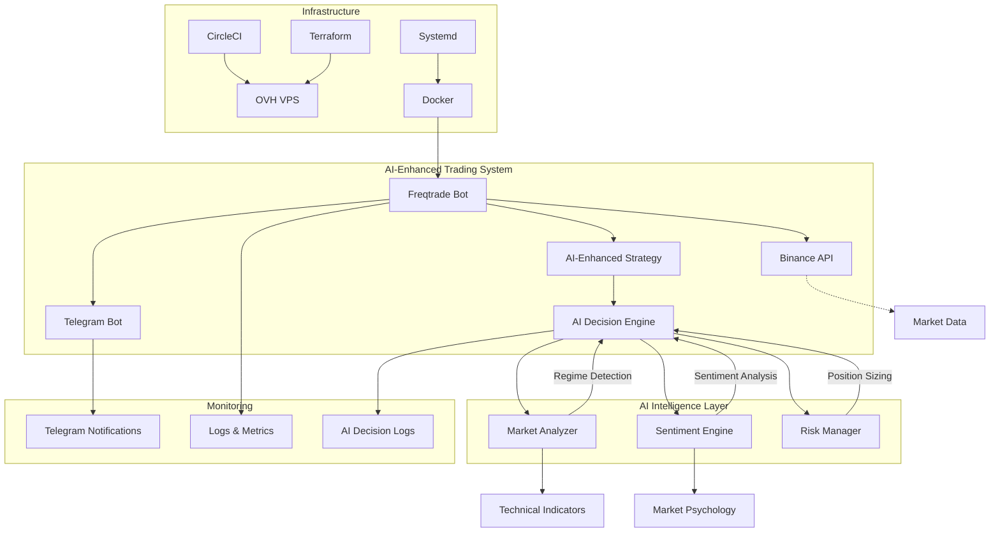
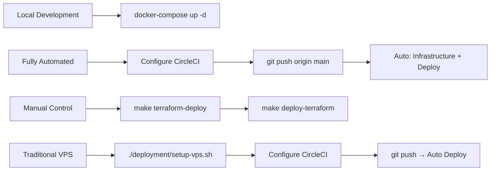
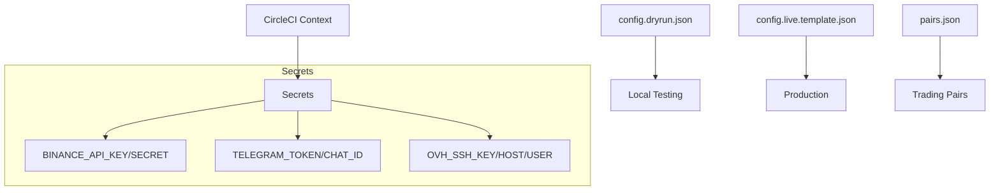
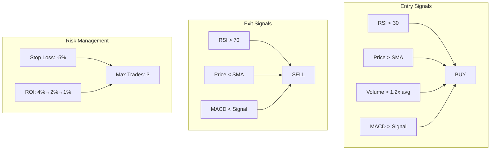
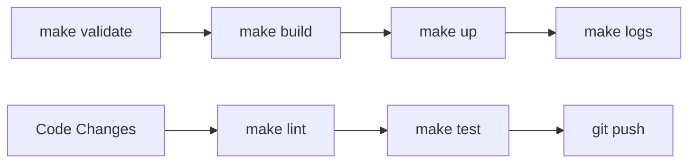
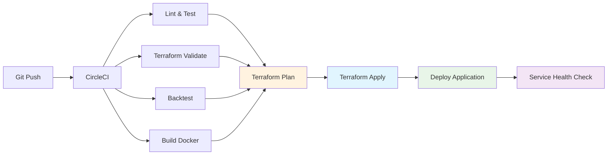
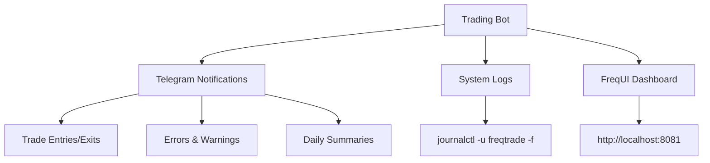
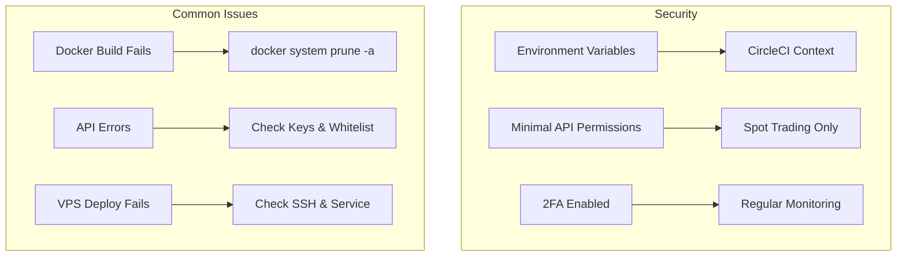

# AI-Enhanced Freqtrade Trading Bot

Automated cryptocurrency trading bot for Binance with **Advanced AI Reasoning** capabilities, complete CI/CD and VPS deployment.

## 🤖 AI-Enhanced Features

This project integrates cutting-edge AI reasoning into FreqTrade to leverage modern AI advancements:

- **🧠 Market Regime Detection**: AI identifies bull, bear, sideways, volatile, and crash market conditions
- **📊 Multi-Modal Sentiment Analysis**: Combines social media, news, and market metrics
- **⚖️ Dynamic Risk Management**: AI-optimized position sizing and stop-loss levels
- **🎯 Real-time Decision Making**: AI analyzes market conditions and adapts strategy in real-time
- **🚨 Emergency Detection**: AI monitors for market crashes and anomalies
- **📈 Adaptive Parameters**: Strategy parameters automatically adjust to market conditions

## Architecture

## Features

### 🤖 AI-Powered Trading
- **AI-Enhanced Strategy**: Traditional RSI+MA enhanced with AI reasoning
- **Market Regime Adaptation**: Different behavior in bull/bear/volatile markets  
- **Sentiment Integration**: Social media, news, and market psychology analysis
- **Dynamic Risk Management**: AI-optimized position sizing and stop losses
- **Emergency Detection**: Automatic exits during market crashes or anomalies
- **Real-time Learning**: AI adapts parameters based on market conditions

### 🏗️ Infrastructure & Deployment
- **Exchange**: Binance Spot | **Notifications**: Telegram | **Strategy**: AI-Enhanced RSI+MA
- **Local**: Docker Compose | **Production**: systemd service | **CI/CD**: CircleCI pipeline
- **Infrastructure**: Terraform for OVH Cloud | **Deployment**: Automated with make commands
- **AI Components**: Market Analyzer, Sentiment Engine, Risk Manager, Decision Engine

## Quick Start

**📋 [Complete Setup Guide](./SETUP.md)** | **✅ [Deployment Checklist](./DEPLOYMENT_CHECKLIST.md)** | **🏗️ [Terraform Guide](./terraform/README.md)**

**Fully Automated**: Configure CircleCI → `git push origin main` → Everything automatic!  
**Manual Control**: `make terraform-deploy` → `make deploy-terraform`  
**Local Dev**: `make quick-start` or `docker-compose up -d`

## Configuration

**Files**: `config.dryrun.json` (testing) | `config.live.template.json` (production) | `pairs.json` (pairs)  
**Secrets**: Set in CircleCI Context `freqtrade-secrets`

## Strategy: RsiMaStrategy

**Indicators**: RSI + SMA + Volume + MACD + Bollinger Bands  
**Risk**: -5% stop loss, ROI table, max 3 trades

## Development

**Commands**: `make quick-start` | `make validate` | `make logs` | `make down`

## CI/CD Pipeline

**Pipeline Features:**
- **Infrastructure as Code**: Terraform validates and provisions OVH infrastructure
- **Automated Testing**: Linting, backtesting, and Docker builds
- **Zero-Touch Deployment**: Complete infrastructure + application deployment
- **Health Monitoring**: Automatic service verification and rollback capability

## Monitoring

**Local**: `make logs` | **VPS**: `journalctl -u freqtrade -f` | **UI**: http://localhost:8081

## Security & Troubleshooting

**Security**: Environment variables only | Minimal API permissions | 2FA enabled  
**Cost**: OVH VPS SSD 1 (~€3-€5/month) | 1 vCPU, 2GB RAM, 20GB SSD

## ⚠️ Disclaimer

**Trading cryptocurrencies involves significant risk**. Educational purposes only.  
Always test with dry-run mode and small amounts.

## Support

📚 [Freqtrade Docs](https://www.freqtrade.io/) | 💬 [Discord](https://discord.gg/p7nuUNVfP7) | 🐛 GitHub Issues

## 📋 Setup Documentation

- **[SETUP.md](./SETUP.md)** - Complete manual setup guide with step-by-step instructions
- **[DEPLOYMENT_CHECKLIST.md](./DEPLOYMENT_CHECKLIST.md)** - Quick checklist for deployment
- **[.env.example](./.env.example)** - Environment variables template
